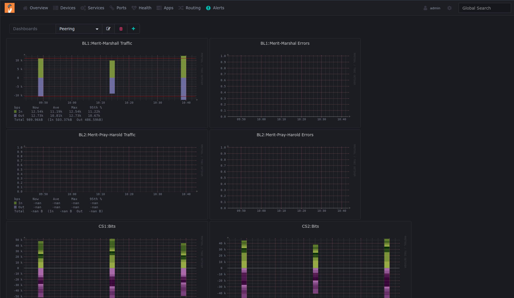
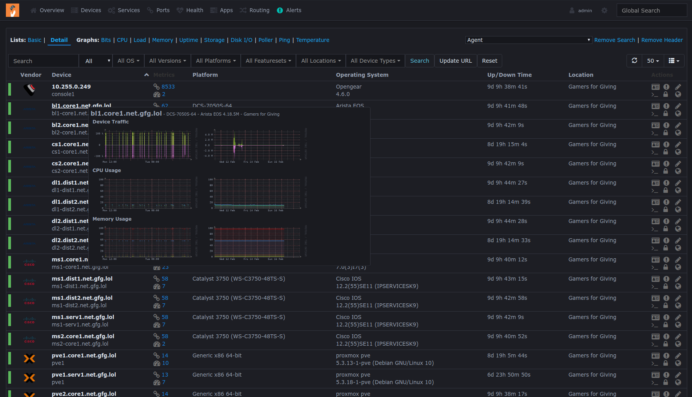
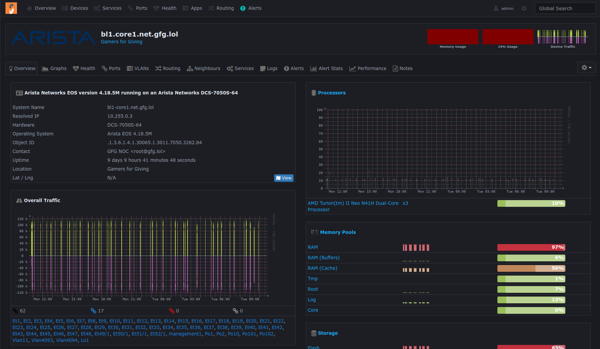

LibreNMS Kibanafeel Theme
=========================
Kibana-Inspired Dark Theme for LibreNMS


## Screenshots





## Installation
Copy `theme_kibanafeel.css` to your installation's CSS directory. Depending on the location of your root directory, this might look like:

```shell
cp theme_kibanafeel.css /opt/librenms/html/css/custom/theme_kibanafeel.css
```

Because certain style-related options are determined by PHP settings and not by CSS, some settings overrides are required. In your installation's configuration, add the following:

```php
<?php

# Theme Configuration
$config['webui']['custom_css'][]        = "css/custom/librenms_kibanafeel.css";
$config['rrdgraph_def_text_color']      = '98A2B3';
$config['list_colour']['even']          = "#1d1e24";
$config['list_colour']['odd']           = "#1d1e24";
$config['list_colour']['highlight']     = "#1d1e24";
$config['list_colour']['even_alt']      = "#1d1e24";
$config['list_colour']['odd_alt']       = "#1d1e24";
$config['list_colour']['even_alt2']     = "#1d1e24";
$config['list_colour']['odd_alt2']      = "#1d1e24";
```


## Installation with Docker
When LibreNMS is run inside of a docker container, theme installation can be accomplished with volume mounts. The following example is based on [LibreNMS's published Docker images and docker-compose.yml](https://github.com/librenms/docker) file.


##### Create a configuration override file `./librenms/config/override.php`:
```php
<?php

# Theme Configuration
$config['webui']['custom_css'][]        = "css/custom/librenms_kibanafeel.css";
$config['rrdgraph_def_text_color']      = '98A2B3';
$config['list_colour']['even']          = "#1d1e24";
$config['list_colour']['odd']           = "#1d1e24";
$config['list_colour']['highlight']     = "#1d1e24";
$config['list_colour']['even_alt']      = "#1d1e24";
$config['list_colour']['odd_alt']       = "#1d1e24";
$config['list_colour']['even_alt2']     = "#1d1e24";
$config['list_colour']['odd_alt2']      = "#1d1e24";

```
More information on configuring the LibreNMS container [here](https://github.com/librenms/docker/blob/master/doc/notes/edit-config.md).

##### Add the following volumes to the `librenms` service:

```yaml
volumes:
  - "./librenms:/data"
  - "./librenms_kibanafeel.css:/opt/librenms/html/css/custom/librenms_kibanafeel.css"
```


## Contributing
Pull-requests to improve this theme are welcome! I do however ask that you try to make any changes consistent with the look, feel, and color pallet of Kibana, as that was the base inspiration for this theme.

## License
The content of this project itself is licensed under the [MIT License](LICENSE).
